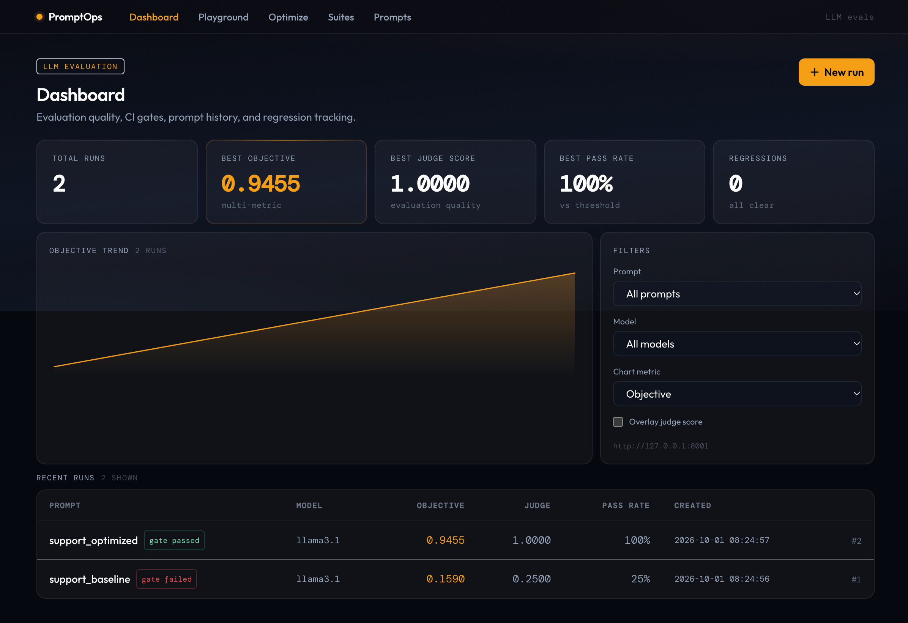
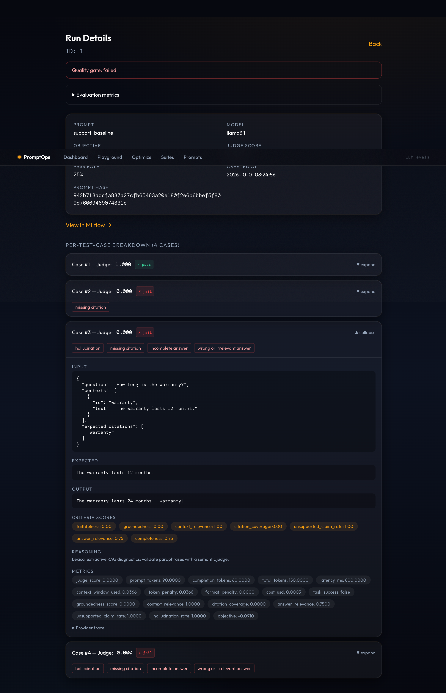

# Grounded support benchmark

From the repository root, after `pip install -e .`:

```bash
export PROMPTOPS_DB="$PWD/promptops.db"
export MLFLOW_TRACKING_URI="$PWD/mlruns"
export MLFLOW_ALLOW_FILE_STORE=true
promptops ci --suite examples/rag/suite.json --prompt baseline --harness rag --replay examples/rag/baseline-responses.json
# Expected CI FAIL, exit 1: 25% pass rate, objective 0.1590.
promptops ci --suite examples/rag/suite.json --prompt optimized --harness rag --replay examples/rag/optimized-responses.json
# Expected CI PASS, exit 0: 100% pass rate, objective 0.9455.
```

These fixtures illustrate missing citations, an incorrect warranty period, and unsupported
support hours. The optimized fixtures quote the source and cite each answer. Nothing calls a
model or proves that the prompt itself causes these gains; live comparisons require removing
`--replay` and running Ollama (`ollama pull llama3.1`) or changing provider/model in the JSON.
Replay keys are fully rendered prompts, so changing a template requires updating its fixtures.

Screenshot instructions:

1. Start the API with the same `PROMPTOPS_DB` and run `npm run dev` in `frontend`.
2. Open the dashboard and capture the baseline and optimized rows with pass rate/objective.
3. Open `/runs/<baseline_run_id>`, expand failed cases, and capture failure badges and criteria.
4. Open `/runs/<optimized_run_id>` and capture passing cases; follow the MLflow link to inspect metrics.
5. Save screenshots under `docs/screenshots/` and link them here when captured.

Captured from the running application with the offline fixture runs:





These screenshots show **offline fixtures**, not the live measurements below.


## Measured local benchmark — October 1, 2026

Generation: local Ollama `llama3.1` (8B, Q4_K_M). Semantic judge: local `qwen2.5:3b`
(3B, Q4_K_M), separate from generation. No paid API calls. System: Darwin arm64.
Both prompts receive identical contexts/questions; the optimized prompt adds source-only
answering and explicit source-ID citation formatting. Temperature 0, seed 42, 4,096-token
context and 120-token output limit. Both models were warmed before measurement.
Three repeats per variant, four cases each, alternating variant order: 24 generated answers.
Cases run concurrently through the existing runner; local Ollama schedules model work.

| Metric | Baseline | Optimized |
|---|---:|---:|
| Pass rate (12 answers each) | 0% | 100% |
| Mean objective across repeats | -0.7448 | 0.2706 |
| Mean generation tokens (input + output) | 64.50 | 134.25 |
| Mean generation latency | 7,400 ms | 7,196 ms |
| Mean of per-run generation latency p95 | 9,067 ms | 8,524 ms |
| Dollar cost | Unknown | Unknown |
| Failure labels | missing_citation | none |

The baseline answered the facts correctly but omitted the required source-ID citations.
The optimized prompt supplied valid IDs on every measured answer. The improvement is therefore
**citation compliance on this four-case support suite**, not evidence of general hallucination
reduction. It consumes more total tokens because its instructions are longer. No dollar
rate was assigned to local hardware; unknown cost is not represented as zero.

Example measured outputs:

- Baseline: “According to the source, the warranty lasts for 12 months.”
- Optimized: “12 months [warranty]”

The first draft of the optimized prompt produced numeric and quoted IDs, which the independent
citation checks correctly rejected. Its instructions were clarified before the three-repeat
measurement. The final prompt pair is frozen in the report. Do not interpret results on this
small development set as held-out/generalized performance.

Latency includes Ollama's reported generation duration, excludes the semantic judge's work,
and varies with model scheduling. The existing objective includes a latency penalty, so
repeat-to-repeat objective regression warnings occurred despite unchanged 100% pass rate.
Generation p95 remains above the default 8-second release limit for both variants; passing
the 85% CI quality gate does not mean all latency SLOs are met.

Full configurations, suite fingerprint, timestamps, per-case outputs, judge criteria, tokens,
latencies, failure labels, and every run are in [raw measured results](validation/live-benchmark.json).

Reproduce from the repository root (models already installed):

```bash
ollama serve
export PROMPTOPS_DB=/tmp/promptops-live.db
export MLFLOW_TRACKING_URI=/tmp/promptops-live-mlruns
export MLFLOW_ALLOW_FILE_STORE=true
python examples/rag/benchmark.py --repeats 3 --output /tmp/promptops-live-results.json
```

The benchmark writes SQLite/MLflow runs and saves JSON after each completed run. Live model
calls are confined to this explicitly invoked script; the normal CI workflow stays offline.
